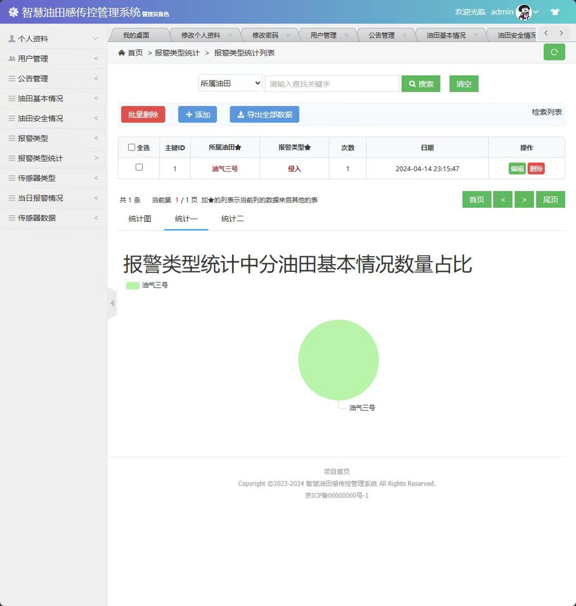

# 智慧油田感知与控制管理系统

[English][en] | 简体中文

这是一个基于经典 SSM 技术栈的 Java Web 管理系统。主要用于学习、课程设计和毕业设计参考。

系统包含用户管理、油田信息、传感器类型、传感器数据、安全信息、公告、告警类型、告警统计和每日告警等模块。

> 注意：本项目使用了较老的依赖，仍包含遗留代码和已知的安全风险。建议仅用于学习目的，不要直接部署到生产环境。

## 项目截图



## 技术栈

- JDK 8
- Maven
- Spring MVC 4.3.5
- MyBatis 3.3.0
- Hibernate 3.6.9
- JSP / JSTL
- MySQL
- Tomcat 8/9
- H-ui、Layui、ECharts、My97DatePicker

## 项目结构

```text
src/main/java/com/edu
├── controller        # Spring MVC 控制器
├── service           # Service 接口
├── service/impl      # Service 实现
├── mapper            # MyBatis mapper 接口和 XML 文件
├── model             # 实体类
└── util              # 工具类

src/main/resources
├── ApplicationContext.xml
├── jdbc.properties   # 本地数据库连接配置
├── mybatis-config.xml
├── hibernate.cfg.xml
└── message_zh_CN.properties

src/main/webapp
├── admin             # 管理员 JSP 页面
├── common            # 共享的 JSP、CSS、JS 和第三方前端资源
├── login.jsp
├── register.jsp
└── WEB-INF/web.xml
```

## 本地运行

1. 创建 MySQL 数据库并导入初始化脚本：

```sql
CREATE DATABASE ssm_youtiansys DEFAULT CHARACTER SET utf8mb4 COLLATE utf8mb4_general_ci;
```

然后导入：

```text
docs/database.sql
```

2. 复制数据库配置模板：

```bash
cp src/main/resources/jdbc.properties.example src/main/resources/jdbc.properties
```

在 Windows PowerShell 中：

```powershell
Copy-Item src/main/resources/jdbc.properties.example src/main/resources/jdbc.properties
```

然后编辑：

```text
src/main/resources/jdbc.properties
```

默认模板：

```properties
jdbc.driver=com.mysql.cj.jdbc.Driver
jdbc.url=jdbc:mysql://127.0.0.1:3306/ssm_youtiansys?useSSL=false&serverTimezone=Asia/Shanghai&useUnicode=true&characterEncoding=UTF-8&allowPublicKeyRetrieval=true
jdbc.username=your_mysql_username
jdbc.password=your_mysql_password
```

Spring MVC 和遗留的 Hibernate 工具类都读取同一个配置文件。

3. 使用 Maven 构建项目：

```bash
mvn clean package
```

4. 将生成的 WAR 文件部署到 Tomcat：

```text
target/ssm_youtiansys.war
```

5. 打开应用：

```text
http://localhost:8080/ssm_youtiansys/
```

## 默认账号

数据库脚本中包含一个管理员账号：

```text
username: admin
password: admin
```

当前登录逻辑默认以明文方式比较密码。如果启用 MD5 登录，请同时更新初始数据库密码和相关登录代码。

## 数据库

初始化脚本位于：

```text
docs/database.sql
```

该脚本根据现有的 MyBatis mapper 文件和实体字段重建而成，包含主要业务表和少量演示数据。

如果在不同的 MySQL 平台上遇到表名大小写敏感问题，请保持表名与 MyBatis XML 文件一致。

## 发布前注意事项

- 多个 MyBatis XML 文件使用 `${fieldValue}` 进行查询字符串插值，可能存在 SQL 注入风险。生产环境中请替换为安全的参数绑定或基于白名单的查询。
- 部分依赖较旧，包括 Spring、Shiro、Log4j 和 commons-fileupload。请将本仓库视为学习项目。
- 部分中文文本可能存在历史编码问题。如果页面显示异常，请检查文件编码和服务器编码。
- 本仓库基于 MIT 许可证发布。

## 许可

本项目基于 [MIT License](LICENSE) 许可。

## 免责声明

本项目仅供学习和参考。请勿直接部署到公开的生产环境。

[en]: README.md
